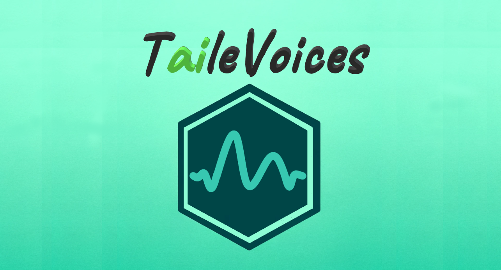

# TaileVoices - Add talking NPCs to your online role-plays

TaileVoices is a platform designed to add some __flavour to your role-playing sessions__.
With the power of __GPT__ and __Discord Bots__ you can truly let your pen & paper adventures become magical!

## How it works

You can setup NPCs by giving them a script they should follow and a voice they should use while speaking.
Once you add the Discord Bot to your voice channel it will automatically begin transcribing all of the conversation and storing it in a database as "memory" of the AI.
Then the NPC will seamlessly integrate into the conversation and talk either once it seems fit or if it is addressed directly.
